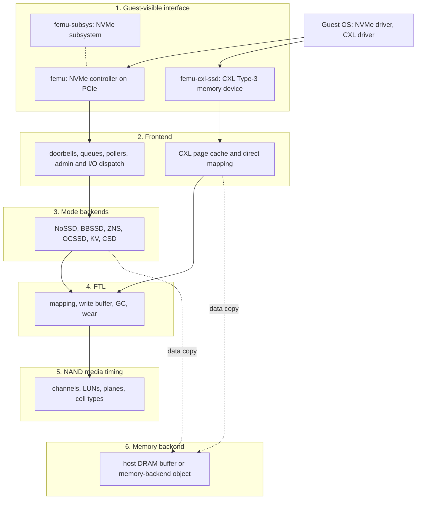

# FEMU architecture

FEMU is QEMU with a set of emulated storage devices under `hw/femu/`. This
page describes those devices as a stack of layers, from what the guest sees
down to the host memory that holds the data. Each section says what the layer
does, where its code lives, which threads run it, and where it charges time.

Two ideas explain most of the design:

- **Data and time are separate.** The guest's data is copied into a host
  memory buffer as soon as a command is parsed. The FTL and NAND model never
  touch the data; they only compute how long the command would take on a real
  device, and the completion is held back until that time has passed.
- **Commands run on FEMU's own threads, not on the vCPU.** For NVMe, a
  doorbell write only records the new queue tail. Polling threads fetch and
  execute the commands, and an FTL thread computes their timing.

The CXL SSD (`femu-cxl-ssd`) is the exception to the second rule: its loads
and stores are served on the vCPU thread that issued them. The
[CXL SSD design note](../cxlssd.md) covers it in depth.

## The layers

Solid arrows carry commands and timing. Dotted arrows carry the data, which
goes straight to the memory backend.

| Layer | Main source files | Threads |
| --- | --- | --- |
| 1. Guest-visible interface | `hw/femu/femu.c`, `hw/femu/femu-props.c`, `hw/femu/intr.c`, `hw/femu/cxlssd/qemu-adapter.c` | vCPU threads, QEMU main loop |
| 2. Frontend | `hw/femu/nvme-io.c`, `hw/femu/nvme-admin.c`, `hw/femu/dma.c`, `hw/femu/lib/`, `hw/femu/cxlssd/cxlssd.c`, `hw/femu/cxlssd/cache.c` | `femu-poller`, vCPU threads |
| 3. Mode backends | `hw/femu/nossd/`, `hw/femu/bbssd/bb.c`, `hw/femu/zns/zns.c`, `hw/femu/ocssd/`, `hw/femu/kvssd/`, `hw/femu/csd/` | `femu-poller` |
| 4. FTL | `hw/femu/bbssd/`, `hw/femu/zns/zftl.c`, `hw/femu/kvssd/kvssd-ftl.c` | `FEMU-FTL-Thread`, `femu-cxl-ftl` |
| 5. NAND media timing | `hw/femu/nand/`, `hw/femu/timing-model/` | the caller's thread |
| 6. Memory backend | `hw/femu/backend/dram.c`; for CXL, a QEMU memory backend object | the thread that copies the data |

## 1. Guest-visible interface

FEMU registers three device types.

**`-device femu`** is a PCIe NVMe controller. It reports NVMe version 1.4 and
PCI ID `1d1d:1f1f` by default (`vid`, `did`). BAR0 holds the controller
registers and the doorbells, MSI-X has one vector per queue plus the admin
queue, and an optional Controller Memory Buffer sits on BAR2 (`cmbsz`,
`cmbloc`). `femu_mode` selects which kind of SSD the controller emulates (see
[layer 3](#3-mode-backends) and [choosing a mode](choosing-a-mode.md)).

Namespaces are not separate devices. There is no FEMU namespace device to put
on the command line; the controller builds its namespaces at realize from
`namespaces`, `namespace_sizes` and `namespace_modes`, and Namespace
Management can add more at run time when `ns_mgmt=on`. Migration and
snapshots are blocked for this device.

**`-device femu-subsys`** is an NVMe subsystem. It is not on any bus. A
controller joins it with `subsys=<id>`, and the subsystem must appear first on
the command line. It is needed for Flexible Data Placement (`fdp=on`) and for
namespaces shared between controllers (`ns_mgmt=on` on the subsystem).

**`-device femu-cxl-ssd`** is a CXL Type-3 volatile memory device, a subclass
of QEMU's `cxl-type3`. Its data lives in the memory backend named by
`volatile-memdev`. FEMU installs an I/O region named `femu-cxl-media` over
every CXL fixed memory window that can reach the device, so guest loads and
stores to the device's address range reach FEMU. Optional extras are a cache
control interface on BAR5 (`cca=on`) and an experiment control channel through
the label storage area (`lsa-control=on`). A `femu` controller can serve the
same medium as an NVMe namespace with `cxl_ssd=<id>`.

Where it lives:

- `hw/femu/femu.c`: QOM types `femu` and `femu-subsys`, `femu_realize()`,
  `nvme_check_constraints()`, PCI and BAR setup, MMIO and doorbell handlers
  (`nvme_mmio_write()`).
- `hw/femu/femu-props.c`: the `femu` and `femu-subsys` property tables. The
  generated [property reference](../reference/properties.md) is built from
  these.
- `hw/femu/intr.c`: MSI-X, MSI and pin interrupts (`nvme_isr_notify_io()`).
- `hw/femu/cxlssd/qemu-adapter.c`: QOM type `femu-cxl-ssd`, realize checks,
  window overlay and address decoding. `hw/femu/cxlssd/props.c`: its
  properties.

Threads: register and doorbell writes are MMIO exits handled on the vCPU
thread that made them, under QEMU's big lock (BQL).

## 2. Frontend

### NVMe queues and the admin path

The admin queue is handled synchronously. A write to the admin submission
queue doorbell calls `nvme_process_sq_admin()` on the vCPU thread, which runs
`nvme_admin_cmd()` in `hw/femu/nvme-admin.c` for each new entry. Commands the
generic code does not know go to the mode's admin hook, for example the BBSSD
vendor command 0xEF.

I/O queues are handled asynchronously. A write to an I/O submission queue
doorbell only stores the new tail (`nvme_process_db_io()`). The host can also
set up shadow doorbells with the standard Doorbell Buffer Config command
(`nvme_set_db_memory()`); a queue with a shadow doorbell is then read from
that buffer, and FEMU publishes EventIdx values so the host can skip doorbell
writes it does not need.

### Pollers

When the host enables the controller, `nvme_start_dataplane()` creates the
poller threads (`femu-poller`) once. Each poller loops over the I/O queues it
owns (`nvme_poller()` in `hw/femu/nvme-io.c`). How many pollers there are is
set by two properties:

| `multipoller_enabled` | Pollers | Queues per poller |
| --- | --- | --- |
| `0` (default) | 1 | all I/O queues |
| `1` | ceil(`queues` / `poller_ratio`) | queues `i`, `i + N`, `i + 2N`, ... for poller `i` of `N` |

Any other value fails realize. A poller fetches commands from a queue without
a lock, so every queue must have exactly one owner.

Each poller owns three structures, all indexed by poller number:

- `to_ftl[i]`: a ring of requests waiting for timing.
- `to_poller[i]`: a ring of timed requests coming back from the FTL thread.
- `pq[i]`: a priority queue of timed requests, ordered by completion time.

The rings are in `hw/femu/lib/rte_ring.c` and the priority queue in
`hw/femu/lib/pqueue.c`.

### I/O dispatch

For each new submission queue entry, `nvme_process_sq_io()`:

1. copies the command and stamps the request with the current host time
   (`QEMU_CLOCK_REALTIME`) as both its start time and its completion time;
2. calls `nvme_io_cmd()`, which handles the commands every block mode shares
   (Flush, Dataset Management, Compare, Write Zeroes, Copy, Verify, Write
   Uncorrectable, I/O Management) and passes the rest to the namespace's mode
   (`ns->ext_ops.io_cmd`);
3. puts the request on `to_ftl[i]`.

For Read and Write, the mode handler calls `nvme_rw()`, which checks the
command, maps the guest's PRP or SGL list (`hw/femu/dma.c`) and copies the
data between guest memory and the memory backend with `backend_rw()`. The data
transfer is finished at this point, on the poller thread, before any time has
been charged.

NoSSD skips the rings: it posts the completion inside the same sweep, unless
the host-link or firmware-CPU model is enabled.

### Completion

`nvme_process_cq_cpl()` runs at the end of every sweep. It drains the timed
requests (from `to_poller[i]` when an FTL thread exists, otherwise straight
from `to_ftl[i]`), adds the optional host-link and firmware-CPU time, and
inserts them into `pq[i]`. Then it posts every request whose completion time
has passed and raises one interrupt per completion queue it posted to. A
request that is not due yet stays in the queue for the next sweep. This is
where FEMU enforces latency: nothing sleeps, the completion is simply not
posted before its time.

### CXL accesses

The CXL device has no queues. A guest load or store to its range is an MMIO
access on the vCPU thread, routed through the host bridge and endpoint
decoders to `femu_cxl_access()` in `hw/femu/cxlssd/cxlssd.c`. A page-granular
cache (`hw/femu/cxlssd/cache.c`, policies `fifo`, `lifo`, `clock`, `s3-fifo`)
decides whether the access needs the FTL. The cache keeps only page numbers
and dirty bits; the data is always in the memory backend. With `der=memslot`
or `der=cylon`, cached pages can be mapped into the guest so that later
accesses do not reach QEMU at all (see the
[CXL load walkthrough](#cxl-load-walkthrough)).

## 3. Mode backends

A mode is a table of handlers (`FemuExtCtrlOps` in `hw/femu/nvme.h`).
`nvme_register_extensions()` in `hw/femu/femu.c` installs the table for the
controller's `femu_mode`, and `nvme_register_extensions_ns()` gives each
namespace the table for its own mode, so one controller can mix modes with
`namespace_modes`. I/O commands are dispatched on the namespace's mode, not
the controller's.

| Mode | `femu_mode` | Code | What the I/O handler does | Where time is computed |
| --- | --- | --- | --- | --- |
| OCSSD | 0 | `hw/femu/ocssd/oc12.c` (`lver=1`), `hw/femu/ocssd/oc20.c` (`lver=2`) | Open-Channel vector commands; the host runs the FTL | in the poller, from chip and channel timestamps (`hw/femu/timing-model/timing.c`) |
| BBSSD | 1 | `hw/femu/bbssd/bb.c` | Read and Write through `nvme_rw()` | FTL thread, `bb_ftl_process_req()` |
| NoSSD | 2 | `hw/femu/nossd/nop.c` | Read and Write through `nvme_rw()` | none |
| ZNS | 3 | `hw/femu/zns/zns.c` | zoned command set, zone state machine | FTL thread, `zns_ftl_process_req()` |
| CSD | 4 | `hw/femu/csd/csd.c` | computational storage commands plus block I/O | FTL thread for NAND; compute-unit time in the poller |
| KV | 5 | `hw/femu/kvssd/kvssd.c` | key-value command set: Store, Retrieve, Delete, Exist, List | in the poller, through the BBSSD NAND model |

Features that are not modes:

- **Flexible Data Placement**: enabled on `femu-subsys`; only BBSSD places
  data by reclaim unit (`hw/femu/bbssd/ftl-fdp.c`).
- **Several namespaces and per-namespace modes**: `namespaces`,
  `namespace_sizes`, `namespace_modes` (`nvme_init_namespaces()` in
  `hw/femu/femu.c`).
- **Namespace Management**: `ns_mgmt=on` on a NoSSD or BBSSD controller.
- **Metadata and protection information**: `meta`, `mc`, `pi`
  (`hw/femu/nvme-pi.c`), NoSSD and BBSSD only.
- **Streams**: `streams=on` (`hw/femu/nvme-streams.c`).
- **Persistent Event Log**: always on, kept in `pel_file` if set
  (`hw/femu/nvme-pel.c`).

[Choosing a mode](choosing-a-mode.md) lists which of these combine.

Threads: one `FEMU-FTL-Thread` per controller, started at realize only when a
namespace is BBSSD, ZNS or CSD, or the controller shares a BBSSD subsystem
(`femu_needs_ftl_thread()`). It reads every poller's `to_ftl[i]` ring, calls
`femu_ftl_process_req()`, adds the returned latency to the request's
completion time and puts it on `to_poller[i]`. NoSSD, OCSSD and KV
controllers have no FTL thread.

## 4. FTL

### BBSSD

The BBSSD FTL in `hw/femu/bbssd/` is a page-level device FTL. CSD uses it
unchanged, and the CXL SSD runs a private instance of it. Its state is
`struct ssd` (`hw/femu/bbssd/ftl.h`).

- **Geometry.** Channels (`nchs`) hold LUNs (`luns_per_ch`), LUNs hold planes
  (`pls_per_lun`), planes hold blocks (`blks_per_pl`), blocks hold pages
  (`pgs_per_blk`) of `secs_per_pg` sectors of `secsz` bytes. With the defaults
  a page is 4 KiB. A line (superblock) is the same block index on every plane
  of every LUN, so there are `blks_per_pl` lines.
- **Write pointer.** New pages are allocated from the current line in the
  order channel, then LUN, then plane, then page, so consecutive pages land on
  different channels and LUNs and can be programmed in parallel.
- **Mapping** (`mapping`): `page` (default, a full table in memory), `dftl`
  (a cached mapping table of `mapping_cache_mb` whose misses cost NAND reads),
  `hybrid` and `fast` (log-block schemes). Code: `hw/femu/bbssd/ftl-map*.c`.
- **Write buffer** (`buffer_size`, in pages): a DRAM buffer that accepts
  writes and programs them when it fills past `buffer_thres_pcent`. It holds
  page numbers only, since the data is already in the memory backend. FUA
  writes and stream writes go straight to NAND, and Flush drains it. Code:
  `hw/femu/bbssd/ftl-datapath.c`.
- **Read cache** (`read_cache_mb`, `cache_evict`): a DRAM cache of recently
  read pages (`hw/femu/bbssd/ftl-cache.c`).
- **Garbage collection.** After every request the FTL thread runs one
  background GC pass if the share of lines in use has reached
  `gc_thres_pcent`. A write that finds it at `gc_thres_pcent_high` first runs
  GC in the foreground until it drops below. The victim line is chosen by
  `gc_policy` (`greedy` by default). GC reads, programs and erases occupy the
  same LUNs as host I/O. Code: `hw/femu/bbssd/ftl-line-gc.c`.
- **Placement extras**: `hot_cold_sep` writes overwritten pages to separate
  lines, `read_reclaim_limit` and `retention_limit_sec` rewrite lines that
  were read too often or hold old data, and FDP maps reclaim units to lines.
- **Wear**: each block counts its erases. SMART Percentage Used compares the
  average erase count with `pe_cycles_rated`, `nand_bad_blocks` lowers
  Available Spare, and `ecc_step_ns` makes reads of worn or old blocks slower.

Entry point: `bb_ftl_process_req()` in `hw/femu/bbssd/ftl.c`, which dispatches
to `ssd_read()`, `ssd_write()`, `ssd_trim()` and the others in
`hw/femu/bbssd/ftl-datapath.c`.

### Other FTLs

- **ZNS** (`hw/femu/zns/zftl.c`): zones map onto blocks striped over
  `zns_chnls_per_zone` channels. There is no device GC; the host resets zones.
  Writes collect in per-zone SRAM write caches (`zns_num_wc`) and are
  programmed when a cache fills or is evicted. Zone Reset erases the zone's
  blocks.
- **KV** (`hw/femu/kvssd/kvssd-ftl.c`): a hash index of keys, with values
  stored on NAND lines laid out with the BBSSD geometry and timing.
- **OCSSD** has no device FTL. The host addresses channels, LUNs, blocks and
  pages directly.

Threads: `FEMU-FTL-Thread` runs the BBSSD, CSD and ZNS FTLs. The CXL SSD's
FTL runs on its own `femu-cxl-ftl` worker; when an NVMe controller is linked
with `cxl_ssd=`, both threads use the same FTL and take turns on one mutex.

## 5. NAND media timing

`hw/femu/nand/nand-media.c` turns one NAND operation into a completion time.
`nand_media_op()` takes a location (channel, LUN, plane, block, page), an
operation (read, program, erase) and a start time. It keeps a busy-until time
per LUN (BBSSD, CSD, KV) or per plane (ZNS): the operation starts when both
the request and that unit are ready, and the unit stays busy until it ends.
Units that differ run in parallel. A channel bus with command, data and status
phases is modelled only when one of those phases has a non-zero time.

Read, program and erase times come either from flat properties or from
built-in per-cell-type tables (`hw/femu/nand/nand.c`). OCSSD uses the older
chip and channel timestamp model in `hw/femu/timing-model/timing.c`.

[Timing model](timing-model.md) explains the rules and the properties that
control them.

Threads: none of its own. It runs on whichever thread asks: the FTL thread
for BBSSD, CSD and ZNS, the poller for KV and OCSSD, and the `femu-cxl-ftl`
worker for the CXL SSD.

## 6. Memory backend

For `femu`, the data lives in one host buffer of `devsz_mb` MiB, allocated
zero-filled and locked into RAM at realize (`init_dram_backend()` in
`hw/femu/backend/dram.c`). Namespaces are slices of it, packed back to back.
Controllers that share namespaces through a subsystem share one buffer. Every
mode reads and writes this buffer with `backend_rw()`. Nothing is written to a
file, so the contents are lost when QEMU exits. `FEMU_MBE_INTERLEAVE` controls
its NUMA placement (see the [environment
variables](../reference/properties.md#environment-variables)).

For `femu-cxl-ssd`, the data lives in the QEMU memory backend object named by
`volatile-memdev`, for example `-object memory-backend-ram,id=cxlmem,size=4G`.
It must be a non-zero multiple of 256 MiB and at most 120 GiB. `der=cylon`
needs a shared, preallocated hugetlbfs backend. The vCPU thread copies data
to and from it directly. A `femu` controller linked with `cxl_ssd=` uses this
backend instead of allocating its own.

## Threads

| Thread name | Created by | How many | Runs |
| --- | --- | --- | --- |
| vCPU threads and the QEMU main loop | QEMU | one per vCPU | MMIO: controller registers, doorbells, admin commands; CXL accesses and their media wait; QMP and monitor commands |
| `femu-poller` | `nvme_start_dataplane()` when the host enables the controller | 1, or ceil(`queues` / `poller_ratio`) | I/O command fetch and execution, data copy, completion and interrupts |
| `FEMU-FTL-Thread` | `femu_realize()` | 0 or 1 per controller | BBSSD, CSD and ZNS FTL and NAND timing |
| `femu-cxl-ftl` | `femu_cxl_start()` | 1 per `femu-cxl-ssd` with `ftl=on` | FTL and NAND timing for cache misses and write-backs |
| `femu-cxl-cca` | `femu_cxl_cca_start()` | 1 per `femu-cxl-ssd` with `cca=on` | cache control commands from BAR5 |

## Where latency is charged and enforced

| Device or mode | Computed in | Enforced by |
| --- | --- | --- |
| NoSSD | nothing to compute | completion posted in the same sweep |
| BBSSD, CSD, ZNS | `FEMU-FTL-Thread` adds the FTL's latency to the completion time | the poller posts once the time has passed |
| OCSSD, KV | the poller, while executing the command | the poller posts once the time has passed |
| Host link, firmware CPU (`pcie_bandwidth_mbps`, `pcie_prop_delay_ns`, `fw_cpu_ns`) | the poller, before queueing the completion | same |
| `femu-cxl-ssd` | `femu-cxl-ftl` returns the media time of a miss or write-back | the vCPU waits it out before the load or store completes |

## I/O walkthrough: one 4 KiB write on BBSSD

Assume the defaults: `femu_mode=1`, one poller, `buffer_size=0`, 4 KiB pages,
`pg_wr_lat=200000` (200 us), no channel bus model.

1. **Submit.** The guest NVMe driver writes the command into its submission
   queue in guest memory and writes the new tail to the queue's doorbell. The
   vCPU exits to QEMU, and `nvme_process_db_io()` stores the tail. Nothing
   else happens on the vCPU.
2. **Fetch and copy.** The poller sees the new tail on its next sweep.
   `nvme_process_sq_io()` copies the command and stamps it with the current
   time `t0`. `nvme_io_cmd()` passes it to `bb_io_cmd()`, which calls
   `nvme_rw()`: the LBA range and size are checked, the PRPs are mapped, and
   `backend_rw()` copies the 4 KiB from guest memory into the memory backend at
   the namespace's offset. The data is now where later reads will find it.
3. **Hand to the FTL.** The poller puts the request on `to_ftl[1]` and goes
   on with other queues.
4. **Time it.** The FTL thread takes the request and calls
   `bb_ftl_process_req()`, which calls `ssd_write()`. If too few lines are
   free, foreground GC runs first. The one logical page is mapped to the next
   physical page at the write pointer, the old copy (if any) is marked
   invalid, and `ssd_advance_status()` asks the media layer for a program on
   that page's LUN. If the LUN is idle the program takes 200 us from `t0`; if
   it is busy until `t1`, it ends at `t1` + 200 us. The LUN stays busy until
   then. If enough lines are now in use, one background GC pass follows; its
   NAND operations make the LUNs they use busy for later requests.
5. **Return.** The FTL thread adds the latency to the request's completion
   time and puts it on `to_poller[1]`.
6. **Hold.** On a following sweep, `nvme_process_cq_cpl()` moves the request
   into the priority queue. It stays there until the host clock passes its
   completion time.
7. **Complete.** The poller writes the completion entry into the guest's
   completion queue and, at the end of the sweep, raises the queue's
   interrupt. The guest sees the write complete about 200 us after the poller
   fetched it on an idle device.

With `buffer_size` set, step 4 puts the page in the write buffer instead and
charges a DRAM access (`pg_rd_lat` / 16, 2.5 us with the defaults). The
program happens on a later write that pushes the buffer past its threshold,
and that write pays for it.

## CXL load walkthrough

The guest loads 8 bytes from a `femu-cxl-ssd` region at host physical address
`hpa`. With the cache on (`cache-pages` > 0):

1. **Trap.** Unless the page is mapped directly (below), the load exits to
   QEMU on the vCPU thread. The `femu-cxl-media` overlay routes it through the
   window, host bridge and endpoint decoders to a device address, and calls
   `femu_cxl_access()`.
2. **Hit.** If the page is in the cache, no media time is charged. The vCPU
   copies the 8 bytes from the memory backend and returns. The cost is the
   MMIO exit itself, paid on every access.
3. **Miss.** The page must be brought into the cache:
   - If the set is full, the policy evicts a victim. A dirty victim is first
     written back, which costs a NAND program.
   - The page is read from NAND: the vCPU drops the BQL, queues a read for the
     `femu-cxl-ftl` worker, and waits for the latency it returns. A page the
     FTL has never mapped costs nothing to read.
   - `femu_cxl_delay()` waits out the rest of the media time, sleeping until
     100 us before the deadline and spinning for the rest, with the BQL
     dropped so other vCPUs keep running.
   - The vCPU copies the data from the memory backend. With
     `prefetch-degree` set, the next pages are inserted into the cache with no
     NAND read.

   A store follows the same path and marks the page dirty. A store miss reads
   the page first, as a write-allocate cache does.

What happens to the next access to the same page depends on `der`:

| `der` | After a miss or hit | Next access to the page |
| --- | --- | --- |
| `off` (default) | nothing | traps again; a hit with no media time |
| `memslot` | the page is mapped as a one-page KVM memory slot alias (at most 1024 for all devices) | goes straight to host memory with no exit and no time charged |
| `cylon` | the page is mapped by writing the guest's EPT entry through a Cylon host kernel | goes straight to host memory; dirty state comes from EPT dirty bits |

A direct mapping is removed when its page is evicted, flushed or invalidated,
and the next access traps again. `der=cylon` needs a Cylon host kernel and a
hugetlbfs backend; when either is missing the device falls back to `off` with
a warning. The [CXL SSD design note](../cxlssd.md) gives the details.

## Related pages

- [Choosing a mode](choosing-a-mode.md)
- [Timing model](timing-model.md)
- [CXL SSD design note](../cxlssd.md)
- [Device property reference](../reference/properties.md)
